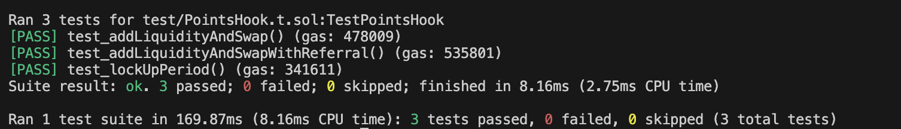

## Capstone Project - Time-Locked Liquidity

# Video

<div align="center">
    <iframe width="560" height="315" src="https://www.loom.com/share/27e4d7bffc7b4abe904be573f6b24444" frameborder="0" allowfullscreen></iframe>
</div>

For the capstone project, I decided to add a simple time lock to adding liquidity to the loyalty example provided to us in the course.

This is because in the original repo (Hardik's repo) for issuing points, it was remarked that points can be abused without a period of time for lock-up, allowing for abuse (i.e. people can add liquidity, remove, and add again).

### Before Remove Liquidity Flag

The main change therefore is adding a hook "Hooks.BEFORE_REMOVE_LIQUIDITY_FLAG" to check if the lock-up period has elapsed before removing liquidity.

### Solidity Addition to POINTS Contract

```solidity
// added to track time stamp of when liquidity is added
    mapping(address => uint256) public liquidityAddedTimestamp;
// added for minimum lock-up period
    uint256 public constant MINIMUM_LOCKUP_TIME = 7 days; 
// for hook permissions, set to true for beforeRemoveLiquidity: true,

// one added function
   function beforeRemoveLiquidity(
        address sender,
        PoolKey calldata,
        IPoolManager.ModifyLiquidityParams calldata,
        bytes calldata
    ) external view override returns (bytes4) {
        require(
            block.timestamp >= liquidityAddedTimestamp[sender] + MINIMUM_LOCKUP_TIME,
            "Liquidity is still locked"
        );
        return this.beforeRemoveLiquidity.selector;
    }
```

Here before the IPoolManager can modify the liquidity params, it needs to check if the lock-up period has elapsed

### Testing

```solidity
    function test_lockUpPeriod() public {
        bytes memory hookData = hook.getHookData(address(0), address(this));

        modifyLiquidityRouter.modifyLiquidity{value: 0.003 ether}(
            key,
            IPoolManager.ModifyLiquidityParams({
                tickLower: -60,
                tickUpper: 60,
                liquidityDelta: 1 ether,
                salt: 0
            }),
            hookData
        );

        // Attempt to remove liquidity before the lock-up period ends
        vm.expectRevert("Liquidity is still locked");
        modifyLiquidityRouter.modifyLiquidity(
            key,
            IPoolManager.ModifyLiquidityParams({
                tickLower: -60,
                tickUpper: 60,
                liquidityDelta: -1 ether,
                salt: 0
            }),
            hookData
        );

        // Warp forward in time to surpass the lock-up period
        vm.warp(block.timestamp + hook.MINIMUM_LOCKUP_TIME() + 1);

        // Now attempt to remove liquidity after the lock-up period ends
        modifyLiquidityRouter.modifyLiquidity(
            key,
            IPoolManager.ModifyLiquidityParams({
                tickLower: -60,
                tickUpper: 60,
                liquidityDelta: -1 ether,
                salt: 0
            }),
            hookData
        );
    }
```

### Test Results



### Additional Code

In addition to this, the repo attempts to add 2 more hooks (beforeSwap and beforeAddLiquidity). These hooks are copied over from the Amulet/Pirate Chest repos in Uniswap academy where I thought they essentially could be KYC users or licensed liquidity providers. These have been commented out in the code as they have not been fully integrated. 

## Foundry

**Foundry is a blazing fast, portable and modular toolkit for Ethereum application development written in Rust.**

Foundry consists of:

-   **Forge**: Ethereum testing framework (like Truffle, Hardhat and DappTools).
-   **Cast**: Swiss army knife for interacting with EVM smart contracts, sending transactions and getting chain data.
-   **Anvil**: Local Ethereum node, akin to Ganache, Hardhat Network.
-   **Chisel**: Fast, utilitarian, and verbose solidity REPL.

## Documentation

https://book.getfoundry.sh/

## Usage

### Build

```shell
$ forge build
```

### Test

```shell
$ forge test
```

### Format

```shell
$ forge fmt
```

### Gas Snapshots

```shell
$ forge snapshot
```

### Anvil

```shell
$ anvil
```

### Deploy

```shell
$ forge script script/Counter.s.sol:CounterScript --rpc-url <your_rpc_url> --private-key <your_private_key>
```

### Cast

```shell
$ cast <subcommand>
```

### Help

```shell
$ forge --help
$ anvil --help
$ cast --help
```
